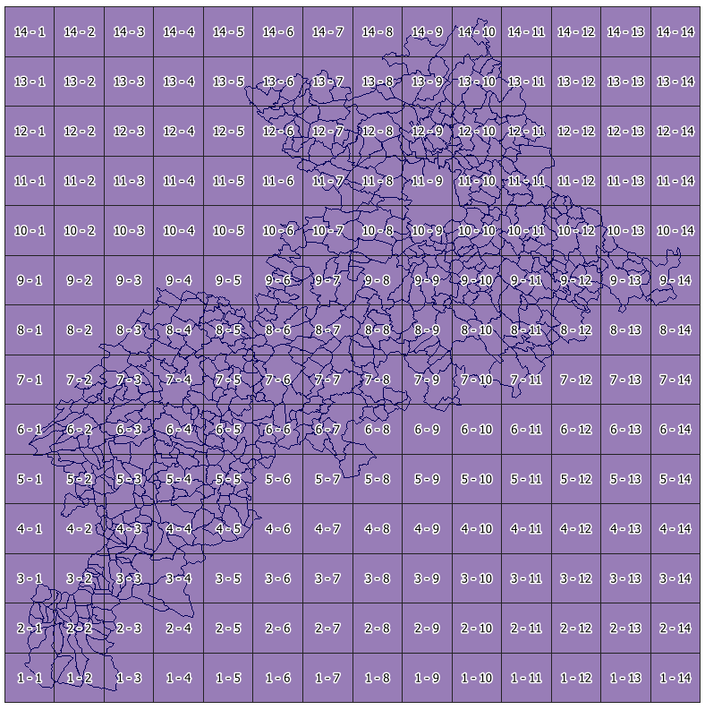

# Création d'un index graticulé pour une couche dans QGIS
Le graticule est une grille de polygones (souvent des carrés) recouvrant une carte.
Cette grille va servir d'index pour les entités de la ou des couches qu'elle recouvre, ce qui permettra de localiser plus facilement ces entités.

### Exemple:
Indexer avec un graticule présentant des carrés de 10km de coté la couche des communes de la Haute-Garonne.
Sur la carte, les colonnes seront indexées par des lettres (de A à ... n de l'ouest vers l'est), et les lignes par des chiffres de 1 à ... n du nord vers le sud.
La carte présentera une liste de toutes les communes du département, ordonnée alphabétiquement, avec pour chacune d'elles, ses coordonnées dans la grille.

## Créer la grille qui servira de graticule
QGIS propose un outil qui permet de créer ce type de grille:

    - Dans QGIS, ouvrir la couche pour laquelle on crée le graticule.
    
    - QGIS - Traitement - Boîte à outils
    
        - Rechercher graticule
        
        - Double-cliquer sur "Create polygons graticule"
        
        - voir la copie d'écran
        
        
Lorsque la grille est créée, la renommer "graticule", c'est le nom qui sera utilisé dans les requêtes ci-dessous.
        
## Adapter la grille 
La grille créée comporte 3 champs: ID | ROW | COL
    - Le champ ROW est indexé à l'envers (voir image) et, dans l'exemple, va de 14 à 1 ... 14 au nord et 1 au sud. Pour l'indexer de 1 à 14 du nord au sud, la formule ABS(14+1-ROW) doit être appliquée.
    - Le champ COL est indexé de 1 à 14 de l'ouest vers l'est. Il faut l'indexer avec des lettres: ici de A à N.
    

    
    
Ouvrir le dbmanager et exécuter cette requête depuis "virtual layer":
```sql
    with alphabet as(
        -- données de base pour les requêtes suivantes: l'alphabet et l'index max des lignes
        select 'ABCDEFGHIJKLMNOPQRSTUVWXYZ' "lettres",  MAX("COL") "num_lignes" FROM graticule
    )
    select geometry, "ID", "COL", "ROW",  
           substr(a."lettres", "COL", 1) "colonne", 
           cast(ABS(a."num_lignes"+1-"ROW") as integer) ligne
    from graticule g cross join alphabet a
```
Les champs "ligne" et "colonne" sont créés et contiennent les valeurs voulues pour les lignes et colonnes.

Puis cocher "charger en tant que nouvelle couche".
Choisir "ID" comme champ unique et "geometry" comme champ de géométrie.

Sauvegarder cette couche sur le disque dur ... Pour la suite, cette couche s'appelle "graticule"

## Indexation des communes
L'index des communes pourrait être l'intersection de la couche des communes avec la grille.
Cependant, les communes peuvent être "à cheval" sur plusieurs cases de la grille.
On pourrait décider de choisir pour indexer une commune la case de la grille qui contient la plus grande surface de la commune, ou la case qui contient le centroïde de la commune.

La couche "admin_express" de l'IGN contient une couche de points "CHEF_LIEU" qui est censée matérialiser "le centre de la zone d’habitat dans laquelle se trouve la mairie de la commune".

Cette couche de points sera donc utiliser ici pour indexer les communes. 
En exécutant cette requête ...
```sql
    select c.insee_com, c.statut, c.nom_chf, g.colonne colonne, g.ligne ligne
    from CHEF_LIEU_031 c
    inner join graticule g on st_intersects(g.geometry, c.geometry)
    order by nom_chf
```
... On obtient une table de données attributaires qui servira ensuite d'index dans la mise en page QGIS.
Cocher "charger en tant que nouvelle couche".
Choisir "INSEE_COM" comme champ unique décocher "Colonne de géométrie".
Enregistrer cette table sur le disque dur, au format ODS par exemple ... Pour la suite, cette table s'appelle "index_communes"

## Mise en forme
### Etiquetage de la grille
Seront étiquetées:
    - Les cases de la première ligne avec les valeurs de colonnes
    - Les cases de la première colonne avec les valeurs de lignes


Dans les propriétés d'étiquetage de "graticule", choisir étiqueter selon des règles et créer 2 règles:


Puis dans le placement des étiquettes (Onglet position), choisir "décalé du centroïde" et 
décaler de -7000 Unités de carte (cas de carrés de 10000m de côté) en x pour la première colonne et en y pour la première ligne.
Affiner la position des étiquettes avec le contrôle Quadrant (Onglet position).
Régler la taille de la police.


